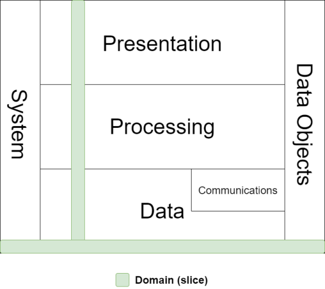
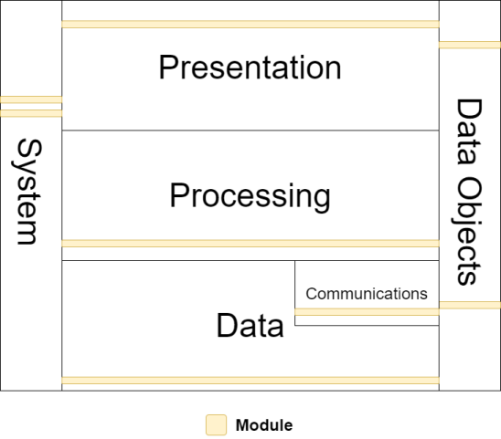
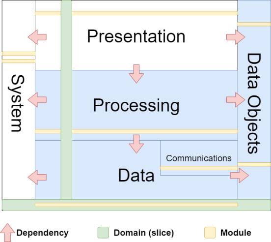

# 3-tier Architecture

A  3-tier architecture decomposes a system into 3 primary tiers.

**1.**  **Presentation**: responsible for all aspects of the User Interface (UI). Includes graphical, console and service application executables. Contains all presentation-oriented modules that may depend on processing-tier modules for acquiring their data models defined in the Data Objects tier.

**2.**  **Processing**: responsible for computational and algorithmic modules. Includes application logic, business logic, consensus rules, security, cryptography.  This tier contains computational-oriented projects which do not depend on user interaction, but may on data tier.

**3.A.**  **Data**: responsible for storage-oriented modules. Includes database drivers, blockchain databases, relational databases, file-based storage formats.

**3.B.** **Communications**: responsible for all communication modules in the application. These modules include TCP/IP libraries, JSON API clients and services, Web Sockets libraries for the application.

### Ancillary-tiers

**4.** **Data Objects**: a collection of modules that define data objects used throughout the 3 primary tiers. These include light-weight data objects, POCO, file format definitions, database entities, blockchain objects, data-transfer objects (DTOs).

**5.** **System**: general-purpose code that with no dependencies that can be used at any tier.


## Domains

A domain is an aspect of the application which spans across all the tiers. It is essentially a vertical slice of the tiers which models a logical group of abstractions.

Domains in an an crypto-exchange application may include Users, Accounts, Markets, Blockchain-integration.




## Modules

Whereas a domain is a vertical-slice across multiple-tiers, a  module is a horizontal slice of a single tier. These include code-libraries (a .net project), executable code (GUI, console, plugin), resources packages (graphics, sounds, etc). 

A module is synonymous with a "project" and in Hydrogen, a module **is a ** single .NET project. The naming convention for modules is



### Naming Convention

Modules are named according to the following convention `Company.Product.Tier.Domain`.

**Examples**

```
McDonalds.PointOfSale.Presentation.WinFormsApp
McDonalds.PointOfSale.Presentation.iOSApp
McDonalds.PointOfSale.Processing.Billing
McDonalds.PointOfSale.Processing.Rostering
McDonalds.PointOfSale.DataObjects.Billing  
McDonalds.PointOfSale.DataObjects.Rostering
McDonalds.PointOfSale.Data.Rostering

Sphere10.Hydrogen.Core     ; "Core" can be used as a "catch all" for the core tiers.
```


## Framework

A framework is a collection of modules structured and organized into a 3-tier architecture. Frameworks offer domains of functionality which are used to construct applications.



