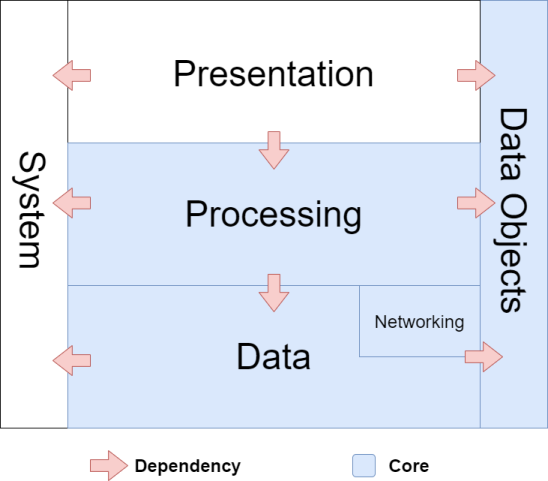

# What is a 3-tier Architecture?

A  3-tier architecture is a method for structuring the code of a non-trivial software system. It typically decomposes a system into 3 primary tiers.

1. **Presentation**: responsible for all aspects that interface with the user. This tier contains all presentation-oriented modules of which may depend on other tiers (primarily, the processing-tier). Modules in this tier include graphical, console and background executables as well as libraries that support    that functionality.

2. **Processing**: responsible for things computational and algorithmic. Modules in the processing tier are also known as "business logic" modules that contains logic which process data. Modules in the processing tier includes application logic, business logic, blockchain consensus rules, cryptographic security, cryptography.  This tier contains computational-oriented projects which do not depend on user interaction, but may on data tier.

3. **Data**: responsible for all things related to data storage-oriented modules. Includes database drivers, blockchain databases, relational databases, file-based storage formats.


### Ancillary-tiers

4. **Communications**: responsible for all communication modules in the application. These modules include TCP/IP libraries, JSON API clients and services, Web Sockets libraries for the application. This tier is contained within the Data-tier.

5. **Data Objects**: a collection of modules that define data objects used throughout the 3 primary tiers. These include light-weight data objects, POCO, file format definitions, database entities, blockchain objects, data-transfer objects (DTOs).

6. **System**: general-purpose code that with no dependencies that can be used at any tier.




## Domains

A domain is a collection of classes that are all logically related in the functionality they provide. The classes in a domain define the object model for a particular abstraction. As a result, a domain may span across multiple tiers of the 3-tier architecture and is often a vertical slice through it (see diagram below).

In the solution space for modelling a "School", examples of domains include Teachers, Students, Admin, Classes, Subjects, Exams.  Each of those domains have classes contained within modules contained within the tiers. Often, domains may be contained within a single tier and thus are found within a single module.


## Modules

Whereas a domain is a vertical-slice across multiple-tiers, a  module is a horizontal slice within single tier. Most modules take the form of a code-library that live within a tier  (e.g. a single "project" in a .NET solution). However, modules in the presentation-tier can also generate an executable artefact that is run within an operating system. These types of "executable modules" include GUI executables targeting a host GUI framework  (i.e WinForms,  QT, WPF, Blazor, WPF, WinForms, Blazor, ASP.NET, etc),  console-based executables and background-running executables (i.e. daemons, services). Modules can also inc.  can also consist of the executable project (GUI, console, plugin), resources packages for graphics, sounds, etc.   


#### Naming Convention

The naming convention for modules is: `Company.Product.Tier.Domain`.

**Examples**

```
McDonalds.PointOfSale.Presentation.WinFormsApp
McDonalds.PointOfSale.Presentation.iOSApp
McDonalds.PointOfSale.Processing.Billing
McDonalds.PointOfSale.Processing.Rostering
McDonalds.PointOfSale.DataObjects.Billing  
McDonalds.PointOfSale.DataObjects.Rostering
McDonalds.PointOfSale.Data.Rostering

Sphere10.Hydrogen.Core     ; "Core" can be used as a "catch all" for the core tiers.
```


## Framework

A framework is a collection of modules structured and organized into a 3-tier architecture. Frameworks offer domains of functionality which are used to construct applications.


