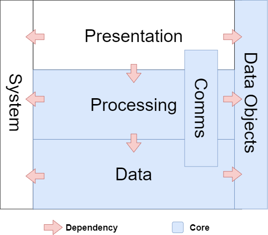
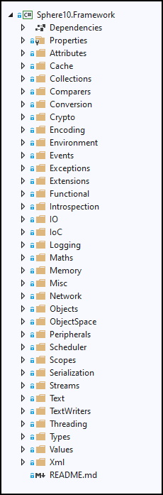

# 3-tier Architecture

A  3-tier architecture is a method for structuring the code of a software system. It typically decomposes a system into 3 primary tiers.

1. **Presentation**: responsible for all aspects user interface. This tier contains all presentation-oriented modules which (may) depend on other tiers for their operation (primarily, the processing-tier). Modules in the presentation-tier include graphical, console and background executables as well as libraries that support that functionality.

2. **Processing**: responsible for things computational and algorithmic. Modules in the processing-tier are also known as "business logic" and are primarily concerned with the processing and transformation of data. Modules in the processing-tier includes application logic, business components, consensus rules and hydrogen core.  Modules in this are computational-oriented that may depend on data tier (and ancillary tiers).

3. **Data**: responsible for all things data-persistence. Includes database drivers, blockchain databases, relational databases, file-based storage formats.


### Ancillary-tiers

4. **Communications**: responsible for all the communication modules in the application. This tier is 1-part presentation, 1-part processing and 1-part data depending on the context. Modules include TCP/IP libraries, P2P protocol implementations, JSON API clients and services, Web Sockets libraries for the application. 

5. **Data Objects**: a collection of modules that define data objects used throughout the 3 primary tiers. These include light-weight data objects, POCO, file format definitions, database entities, blockchain objects, data-transfer objects (DTOs).

6. **System**: general-purpose code that with no dependencies that can be used at any tier.




## Domain

A domain is a grouping of classes that are all logically related in the abstraction they model. The classes in a domain define the object model for that particular abstraction. A domain may span across multiple tiers of the 3-tier architecture and can be depicted as a vertical slice through it (see diagram below). Not all domains span the all tiers, most are contained within one or a few. 

*Example: In the solution space for modelling a "School", domains include Teachers, Students, Admin, Classes, Subjects, Exams.* 


## Module

Whereas a domain is a vertical-slice across multiple-tiers, a  module is a horizontal slice within single tier. Most modules take the form of a code-library that live within a tier  (e.g. a single "project" in a .NET solution). Modules come in three types including a code module, an executable module and a resource module. A code module is simply a library of code (a .NET project). An executable module is also a library of code which compiles to an executable artefact (i.e. console, GUI or service application). A resource module is a grouping of resources consumed by other modules (i.e. sound, images, html/js). 


### Code Module

Since a code-module is a horizontal slice within a tier, it's often the case that it intersects multiple domains. As a result, modules often contain code for multiple domains organized within a sub-folders of that module.

**Example: module that supports multiple domains **




#### Naming Convention

The naming convention for modules is: `Company.Product.Tier.Domain`.

**Examples**

```
McDonalds.PointOfSale.Presentation.PointOfSale
McDonalds.PointOfSale.Processing.Ordering
McDonalds.PointOfSale.Data.SAP;
```

Naming conventions are not strict and can vary reasonable and intuitively given the context. For example, the use of `.Core` as a catch-all tier for processing, communications and  data-tier is employed by Hydrogen.

```
Sphere10.Hydrogen.Core     ; Includes processing, networking, data
```

## Framework

A framework is a collection of modules structured and organized into a 3-tier architecture. Frameworks offer domains of functionality which are used to construct applications.


