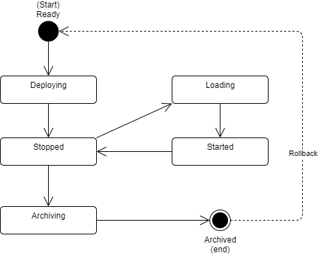
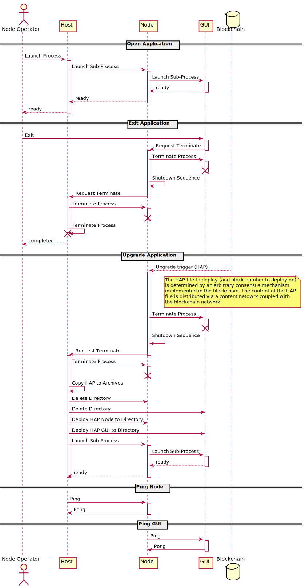

# Hydrogen Runtime

A Hydrogen application is a blockchain-based P2P application based on .NET 5+ stack. Hydrogen applications comprise of the usual Node and GUI design common in existing cryptocurrency applications (like Bitcoin) except they have a crucial distinction. Unlike those applications, Hydrogen Nodes and GUI's can be upgraded by the Blockchain using an arbitrary consensus mechanism. This allows Hydrogen applications to evolve over-time in completely arbitrary manner. Technically, this is achieved by running a Node and GUI within a "Host" that manages their lifecycles.  


## Runtime Model

A Hydrogen application consists of the following sub-systems:

1. **Host**: a top-level application installed by the user that hosts a Hydrogen Application Package (HAP). The purpose of a Host is to manage the lifecycle of a HAP including it's deployment, archival, execution, shutdown and upgrade.  A Host is the only sub-system that remains constant throughout the lifetime of the application and is never upgraded. It is thus a maximally thin, light-weight application that bootstraps the primary application contained within a HAP. Without a Host, it would not be possible for a HAP to completely auto-upgrade itself. 

2. **Hydrogen Application Package (HAP)**: A distribution of a Hydrogen application which typically comprises of a Node and a GUI. A HAP is structured as a ZIP file with a specific folder structure which is unzipped during it's deployment phase.  Once a HAP is deployed, the Host can load the extracted application as part of it's start-up sequence (which in turn may load sub-processes as part of it's own start-up). Although not strictly required, a HAP will typically bundle both a Node and a GUI application. The Host will (typically) launch the Node as a sub-process which in turn loads the GUI as a sub-process. Anonymous pipes between the Host and Nodes are maintained which govern the lifecycle via the [Host Protocol](#host-protocol).
   *  **Node:** a console-based application that runs as sub-process of the Host. The node does the core P2P consensus and processing for the Hydrogen application (as Nodes commonly do for other cryptocurrencies). Nodes offer integration points via JSON APIs, such as mining servers or explorers. For driving GUI's, a Node offers secure web-sockets (WSS) which can be connected to from local **and remote** GUI's. A Node maintains an anonymous pipe to it's Host for maintaining the lifecycle of the HAP. A Node will also (typically) run a GUI as a sub-process and maintain an anonymous pipe to it as well.
   
   * **GUI**: is a process launched by the Node which offers a Graphical User Interface (GUI) to the user. The GUI is (typically) a Kestrel web-server that hosts a Blazor based application based on an extensible and SPA design. This web-application can be accessed via localhost URL. It's important to note that the Blazor GUI can choose to connect to remote public Node for data, not necessarily the localnode.
   
3. **Consensus Databases**: These are file artefacts which reside in a separate directory to the HAP and Host. Files in these folders comprise the consensus data which is constructed by the HAP in the course of it's operation. These files can be anything, from blockchains to SQL databases, and are available to the HAP. These files are not modified by the Host and only the HAP, thus during an upgrade the HAP must be aware of prior file versions and upgrade them within the HAP. The Hydrogen framework provides components for high-frequency blockchains (consensus streams) and state-databases (object spaces) which in the data folders.


### HAP Lifecycle

A HAP lifecycle can be in one of the following states.

* Ready: the HAP is sitting in the `in` folder and ready for deployment.
* Deploying: the existing HAP is being archived and the new HAP is being unzipped into the `hap` folder.
* Stopped: the application is deployed, but not running.
* Loading: the host is loading the application. Any upgrades can occur in this phase.
* Started: the node and GUI are running.
* Archiving: the hap is being zipped and archived.



### Application Folder Structure

The directory structures which govern a HAP are as follows. 

```
%root%               ; root folder dedicated to the application
%root%/hap           ; where the current Hydrogen Application Package (HAP) is deployed to 
%root%/hap/node      ; the Node of the currently deployed HAP
%root%/hap/gui       ; the GUI of the currently deployed HAP
%root%/plugins       ; repository of all user downloaded plugins that extend the current HAP
%root%/content       ; content directory that stores all files used across system, organized by content-hash
%root%/chain         ; blockchain directory where blockchain is stored
%root%/objectspace   ; object-space directory that stores the consensus object space built by the blockchain
%root%/logs          ; all logs for host, node and gui
%root%/temp          ; temp files that persist between application loads (primarily for transactional file pages)
%root%/archive       ; archive of previous HAP's
```


### Host Protocol

The protocol which governs a HAP lifecycle is called the Host Protocol. It comprises of Request-Response and Command style messages between the Host, Node and GUI processes. The underlying channel for the Host Protocol are Anonymous Pipes, although Sphere 10 Framework permits other channels. The below sequence diagram documents the core aspects of the Host Protocol, although the code serves as the [reference documentation][1].




[1]: https://github.com/Sphere10/Hydrogen/tree/master/src/Sphere10.Hydrogen.Core/Runtime "Hydrogen Host Protocol source-code"

